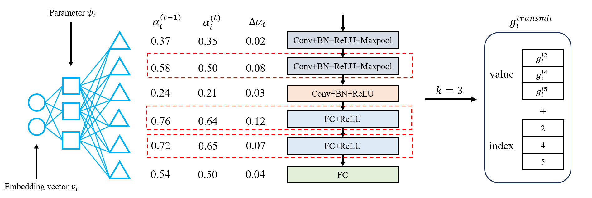

I'm a third year undergraduate student in [Sichuan University](https://www.scu.edu.cn/), majoring in Computer Science and Technology (Top-notch Program). My research interest includes Machine learning system, high perfomance computing and distributed system. 

Currently, I'm an research assistant in [Dicalab](http://www.dicalab.cn/)  advised by [Prof. Qing Ye](https://scholar.google.com/citations?user=jLoTsBYAAAAJ&hl=zh-CN&oi=ao)

## Education

### Bachelor: Sichuan University (2021.9 ~ )
* **Major**: Computer Science and Technology (Top-notch Program), College of Computer Science
* **GPA**: 3.93 / 4.00
* **Average Score**: 92.60 / 100

## Recent Research

### Layer-wised Sparsification Based on Hypernetwork for Distributed NN Training
*Team Lead, Supervised by Qing Ye (Sichuan University)*

* Proposed a layer-wised sparsification method which utilizes hypernetworks to narrow down the communication volume. 
* Constructed an efficient objective function for the hypernetwork to guide the selection of layers for transmission, ensuring that layers which contribute more to the learning process are prioritized to transmit.
* Conducted extensive experiments on different models and datasets. The results validate the efficacy of our method and demonstrate its compatibility with other current compression techniques (e.g., TernGrad, Top-K).
* Outcome: (1st author) A research paper in submission.

## Skills
* Programming Languages: Python, C/C++, MATLAB, LaTex

## Award & Scholarships
* National Scholarship in Sichuan University, 2021-2022
* Merit Student in Sichuan University, 2021-2022
* First Prize, The 14th Lanqiao Cup - Provincial (Sichuan) in C/C++ Programming, 2022
* Third Prize, The 14th Lanqiao Cup - National Final in C/C++ Programming, 2022
* The Second Prize Scholarship in Sichuan University, 2022-2023
* Merit Student in Sichuan University, 2022-2023
* First Prize, The 15th Lanqiao Cup - Provincial (Sichuan) in C/C++ Programming, 2023
* Third Prize, The 15th Lanqiao Cup - National Final in C/C++ Programming, 2023
* Third Prize, 2023 National College Computer Competition - Group Programming Ladder Tournament National Final, 2023
* Second Prize, 2023 National University of Singapore School of Computing Summer Workshop (Visual Computing), 2023 
* First Prize, China Undergraduate Mathematical Contest in Modelling (Sichuan), 2023
